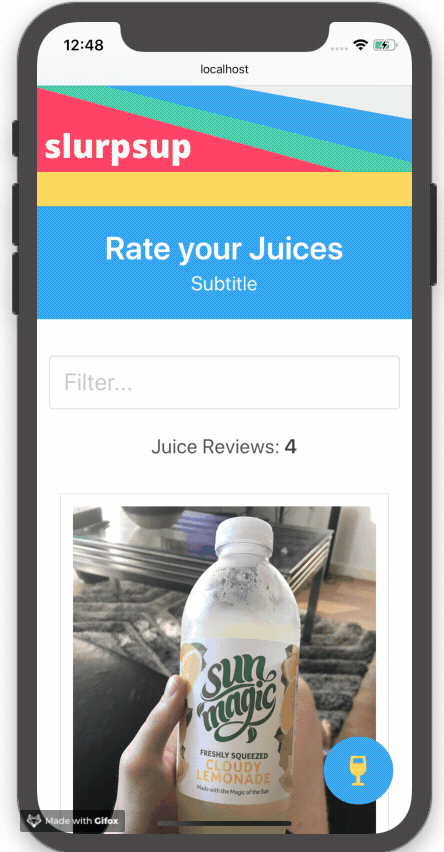

# Slurpsup

Simple fun little web application written in Angular 6 used to review juices. Feel free to pull down the code and play around. 

In order to get the application running successfully you will need to create a firebase datastore. Update the environment.ts file with your firebase config and the app should work as normal.

## Getting Started

These instructions will get you a copy of the project up and running on your local machine for development and testing purposes. See deployment for notes on how to deploy the project on a live system.

## Demo

<div>
    
</div>


### Prerequisites

What things you need to get started:

```
node
angular cli
firebase DB
```

## Running the Application
1. cd into the app directory
2. run `npm install` 
###### (This will install all dependencies for the application)
3. run `ng serve -o` 
###### (This will serve the application at `http://localhost:4200/`. The app will automatically reload if you change any of the source files.. The `-o flag` automatically brings up the browser)

By running ng serve by default the application runs locally. The front end SPA can run without a Firebase DB configured up. However this will stop you from uploading and viewing juice reviews.

```
note: I am currently in the middle of writing a series of blogs on how to create this project from scratch. Follow my Medium account to find out more. 
```
## Running the tests

Application currently has no tests.

## Built With

* [Angular 6](https://angular.io/) 
* [Google Firebase](https://firebase.google.com/?gclid=CjwKCAjwtuLrBRAlEiwAPVcZBmlGAQYDka1HlZdu5OyuUj1v6Lkm9D0i4Tljhfb4KYyCUekabz_dbxoCgTgQAvD_BwE) 


## Authors

* **Sam Bowen-Hughes** - *Initial work* - [Medium](https://medium.com/@sambowenhughes) / [GitHub](https://github.com/sambowenhughes)


## Further help

To get more help on the Angular CLI use `ng help` or go check out the [Angular CLI README](https://github.com/angular/angular-cli/blob/master/README.md).
